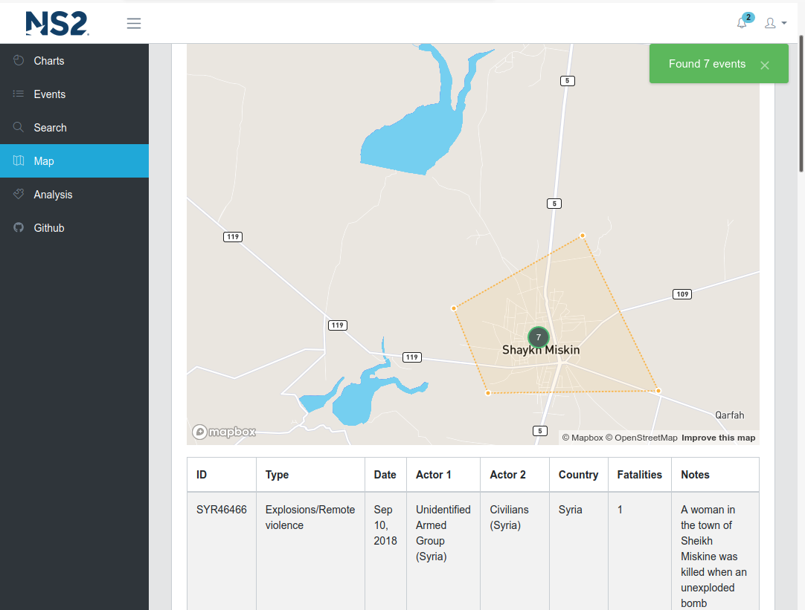
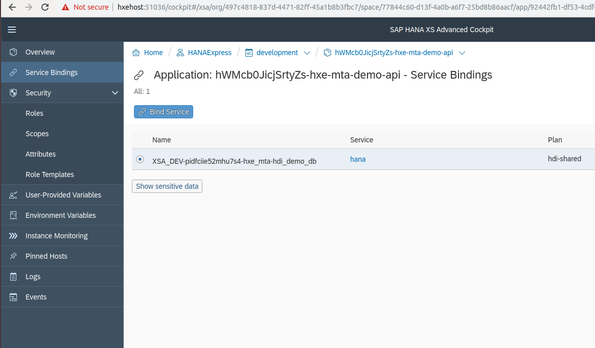

# hxe-mta
A [SAP HANA](https://developers.sap.com/topics/sap-webide.html) multi target application that loads data provided by the [Armed Conflict Location & Event Data](https://www.acleddata.com) project and provides two options for a REST API to power data viewing, search, charts and spatial queries.  

This application was developed using [SAP HANA Express](https://developers.sap.com/topics/sap-hana.html)


A web application that can take advantage of the REST is [github/mechevarria/hxe_angular](https://github.com/mechevarria/hxe_angular)



## Import to WebIDE

To run this project, use the git clone option in [SAP HANA webide](https://developers.sap.com/topics/sap-webide.html) to bring in the project


### Build the database module

> right-click on **demo_db** -> build -> build

This will create the **EVENT** table, full-text index for search and load data from `demo_db/src/data/event.csv`

### Build and deploy the node service

There are two implementations of the REST API, one based on **xsjs** and the other on standard [Express](https://expressjs.com/). Both return the same exact same results and have the same urls. 

* Use the Express implementation if you are already familiar with node. If gives you all the flexibility of the working just with Express but requires you to wire your own routes.

* Even though **xsjs** uses Express as well, it is obfuscated. Use **xsjs** if you are not already familiar with node as the HANA webide does all the wiring code for you.

> right-click on **demo_express** or **demo_xsjs** -> build -> build

After building, deploy the application

> right-click on **demo_express** or **demo_xsjs** -> Run -> Run as Node.js Application

Thats it! Your application will be running on the link shown in the console

## Develop locally

The `demo_express` or `demo_xsjs` node service can be developed locally by adding **one** file.

Create `default-services.json` inside the `/tmp` folder (this path can be changed in `server.js`). Add the following to the file

```json
{
  "hana": {
  }
}
```

> Do **not** check `default-services.json` into source control. This file will contain the HANA connection properties that are usually injected as an environment variable at runtime. `default-services.json` is already added to `.gitignore` in the `demo_xsjs` module.

Get the connection properties logging into the [HANA Express Cockpit](https://developers.sap.com/tutorials/xsa-explore-basics.html) and copying the HANA service credentials

> Home > HANAExpress > development > Service Instances (on the left)



> Select **Show sensitive data** and copy the contents to the `hana` object in `default-services.json`. Your file should look like below

```json
{
  "hana": {
    "schema": "DEMO_DB",
    "hdi_password": "<YOUR_PASSWORD_VALUE>",
    "tenant_name": "HXE",
    "password": "<YOUR_PASSWORD_VALUE>",
    "port": "39015",
    "encrypt": false,
    "db_hosts": [
      {
        "port": 39015,
        "host": "hxehost"
      }
    ],
    "host": "hxehost",
    "hdi_user": "DEMO_DB_71OEEN6U5R5WKIHHNA7EJV95S_DT",
    "user": "DEMO_DB_71OEEN6U5R5WKIHHNA7EJV95S_RT",
    "url": "jdbc:sap://hxehost:39015/?currentschema=DEMO_DB"
  }
}
```

To install, run the following
```bash
npm install
```

Then to start the nodejs application, run
```bash
npm run start
```

### Optional Highlighting in VSCode

To get syntax highlighting for `xsjs` files, open the app Settings

> User > Settings > Text Editor > Files > Edit in `Settings.json`

Then add the following

```json
"files.associations": {
  "*.xsjs": "javascript"
}
```

## Further help

To learn more about SAP HANA development capabilities, go to [developers.sap.com](https://developers.sap.com/)